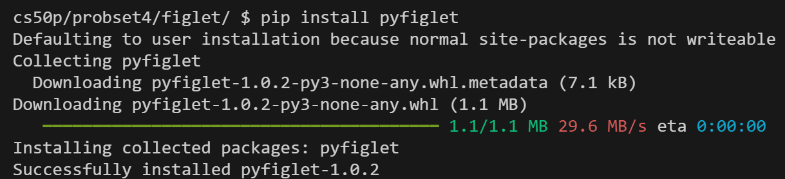

# Lec 4

介绍Python中库的相关知识。

## 模块和包

- import语法
- 随机模块：ramdom.choice, ramdom.randint, ramdom.shuffle
- 统计模块：statastic.mean
- 系统模块：sys.argv, sys.exit
- 用ASCii绘图的彩蛋模块：cowsay
- Python包索引：[Python Package Index](http://pypi.org)
- Python官方的包管理器：pip。此外，Anaconda提供用于机器学习和数据科学的Python发行版，用Conda进行包管理
- 在Python语境下，模块（Module）指一个文件；包（Package）指一个包含多个模块的文件夹，文件夹里还有一个特殊的__init__.py文件指示该包；库（Library）则是包含包和模块的合集。

## API

- 请求模块：request.get().json
- JSON(Java Script Object Notation)格式
- json模块：json.dump

## 自建库

- import或import form语句会完整运行库里的代码
- 当Python文件被直接运行时，__name__会被赋值为"__main\__"（被引用时赋值为模块名）。
- 通过添加判断来运行被引用的文件

    ```python
    if __name__ == "__main__":
        main()
    ```

## Problem Set 4

- 梯子难以跑出的速度



- 使用+=拼接列表时，Python会将右侧视为可迭代对象，比如会将字符串视为字符列表，并进行拼接。str.append则会将参数视为一个整体
- Litter Professor题目要求的的单位加法随机数范围包括了零
- request.get()会通过API获取一个对象，对其调用json方法可以按json格式解码从服务器收到的数据