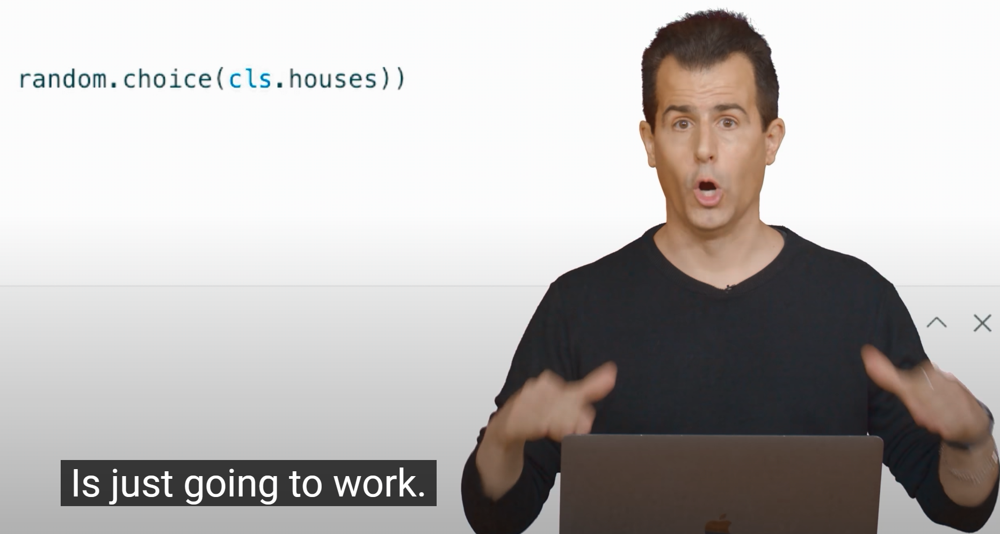
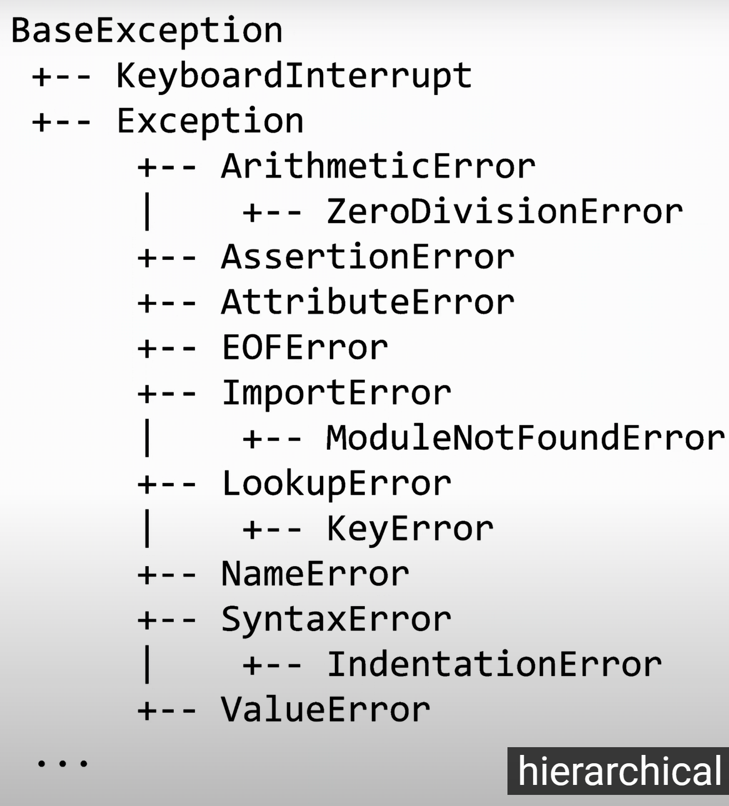

# Lec 8

近3小时的课，面向对象编程。"int""str"等Python的内建类型也同样属于类，面向对象编程通过自定义新的数据类型，提供了一种建模问题和组织程序的方式。

- Python默认将逗号分隔的变量合并为Tuple（/'tʌpl/）

- 类是自定义的数据类型，习惯首字母大写以跟自带的类区分

- 类被定义后可通过调用同名函数来创建该类型的对象（**实例**（Instance））

- 实例中可以添加变量，称为实例的**属性**（Attribute）

- 创建实例时会**自动调用**类自带的函数__init__，该函数的第一个参数默认为self，指向调用该函数的**实例**（方法实际定义于类中，所以要通过self变量指向具体的实例？）

- raise Error("Error Message")

- 类自带的__str__方法会在实例被用作字符串时调用

- **装饰器**是用于修饰函数的函数，@property用于修饰getter函数，会在与该函数同名的变量被"."语法访问时自动调用，此时可通过对应的setter修饰器创建赋值函数。同名的变量和函数存在名称冲突，因此，习惯在实际的属性名前方加一个下划线"_"来解决

    ```Py
    # Getter for house
    @property
    def house(self):
        return self._house

    # Setter for house
    @house.setter
    def house(self, house):
        if house not in ["Gryffindor", "Hufflepuff", "Ravenclaw", "Slytherin"]:
            raise ValueError("Invalid house")
        self._house = house
    ```

- 类的属性会**复制**给实例

- @classmethod修饰器可以将方法定义为**类方法**，不需要具体的实例就可以调用，self参数替换为代表class的cls参数（避免与class关键字冲突）。适用于需要表达一个对象概念，同时不需要多个实例的时候。

    ```Py
    @classmethod
    def sort(cls, name):
        print(name, "is in", random.choice(cls.houses))
    ```

    It Just Works!

    

- （无关编程的知识）"per se": it self; "albeit": although

- 可以通过类方法来**创建**实例

    ```Py
    @classmethod
    def get(cls):
        name = input("Name: ")
        house = input("House: ")
        return cls(name, house)
    ```

- 子类会**继承**父类的属性和方法。通过**super**函数访问父类

- 异常利用了继承特性

    

- ~~Harry Potter 粉丝向课程~~

- 操作符可以被赋予新功能（**operator overload**）。"+"会调用左侧对象的"\_\_add\_\_"方法